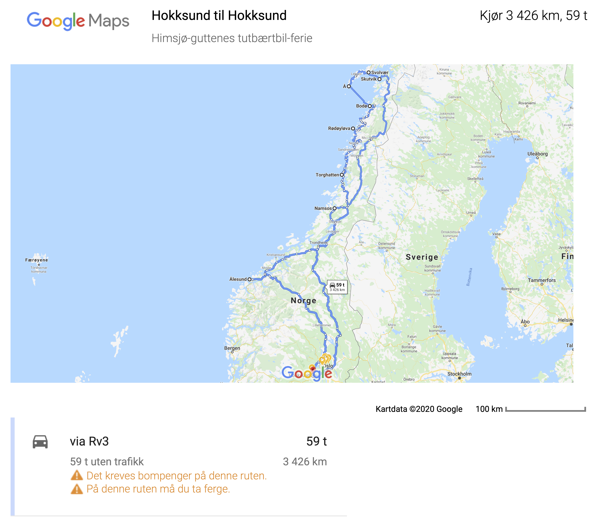

# Himsjø drar på på tutbærtbil-ferie

> Fra 17. til 23. juli skal Nordland fylke rundes. Få den dritten bort (fra bucket lista).

> [Link til Google Drive-oversikt](https://docs.google.com/spreadsheets/d/19lX8EkRglj1zN9EtXYr1DeFMhwgzQbCMvjkAV3heIgU/edit#gid=0)

---

### Kjørerute

### Oversikt

| Dato   | Sted        | Kjøretid (km)    | Attraksjoner            | Hotell  | Tot (per pers) | Hvem     |
| ------ | ----------- | ---------------- | ----------------------- | ------- | -------------- |:-------- |
| 17.07  | Brønnøysund | 13t 8min (930)   | Torghatten              | Bestilt | 3340 (1110)    | J,F,MN   |
| 18.07  | Bodø        | 9t 50min (470.5) | Sandnessjøen, Rødøyløva | Bestilt | 4049 (675)     | Alle     |
| 19.07  | Svolvær     | 5t 17min (222)   | Lofoten                 | Bestilt | -              | J,F,H,MN |
| 21.07  | Namsos      | 12t 28min (745)  | Hotell Rock City        | Bestilt | (645)          | Alle     |
| 22.07  | Ålesund     | 8t 22min (508)   | BYEN                    | -       | -              | -        |
| 23.07  | Hossund     | 7t 44min (556)   | Valutan                 | Bestilt | -              | Alle     |
| TOTALT | Norge       | 56t (3431.5)     | -                       | -       | -              | -        |

### Ønskeliste

- [ ] Telt

- [ ] Power bank

- [ ] Solcellelader

